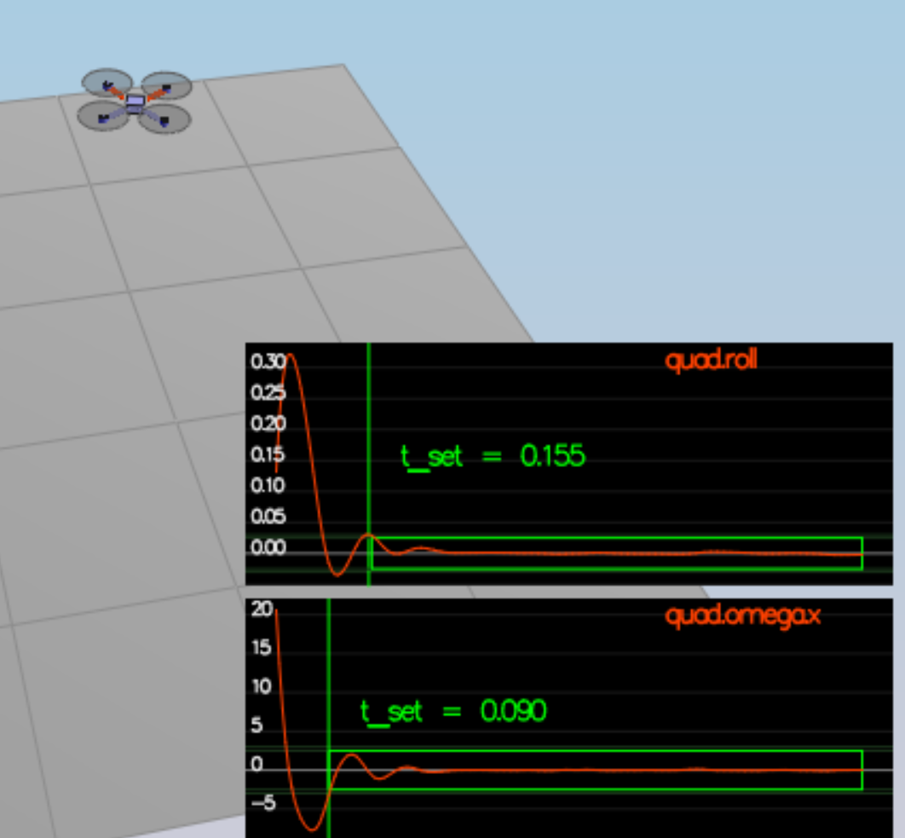
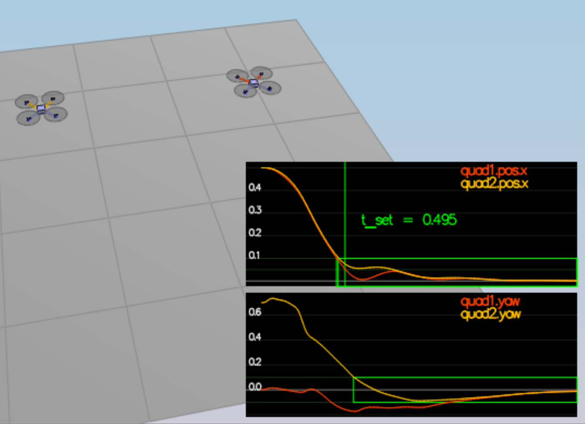
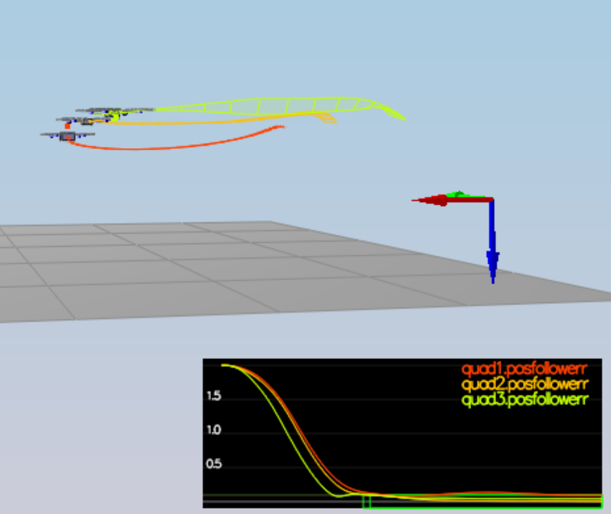
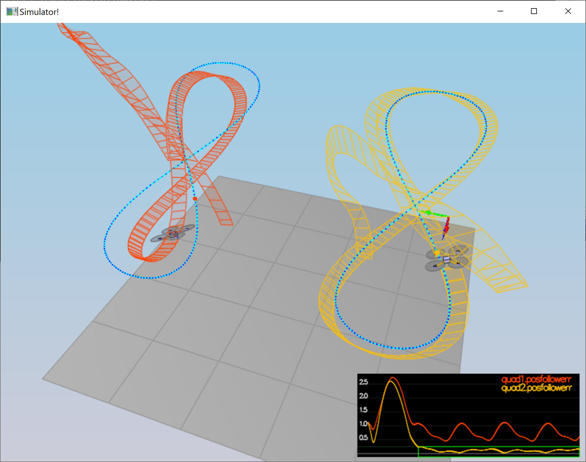

# The C++ Project Readme #

### Testing it Out ###

> Take a moment to tune the `Mass` parameter in `QuadControlParams.txt` to make the vehicle more or less stay in the same spot.

Changed the mass to the correct value of 0.5

### Remarks
> The ratio of `kpV / kpP` should be 4.

That was bad advice. With this ratio bigger than 1 for kpVelXY/kpPosXY, the overall system tended to 
exhibit very unstable behavior; I obtained best results with that ratio
being between 0.33-0.5; my guess is that is because of the coupling of this
feedback loop with the body rate feedback loop.

### Body rate and roll/pitch control (scenario 2) ###
> - implement the code in the function `GenerateMotorCommands()`
> - implement the code in the function `BodyRateControl()`
> - Tune `kpPQR` in `QuadControlParams.txt` to get the vehicle to stop spinning quickly but not overshoot
> - implement the code in the function `RollPitchControl()`
> - Tune `kpBank` in `QuadControlParams.txt` to minimize settling time but avoid too much overshoot

Done, strictly after the formulas in the lessons (screenshot below). Had to 
hardwire `collThrustCmd = 9.81*mass` for this part to get the altitude stable-ish.

One thing that cost me a lot of time was figuring out that [the numbering of motors
in the C++ simulator seems to be different from the Python one](https://github.com/udacity/FCND-Controls-CPP/issues/10).

### Position/velocity and yaw angle control (scenario 3) ###
> - implement the code in the function `LateralPositionControl()`
> - implement the code in the function `AltitudeControl()`
> - tune parameters `kpPosZ` and `kpPosZ`
> - tune parameters `kpVelXY` and `kpVelZ`
> - implement the code in the function `YawControl()`
> - tune parameters `kpYaw` and the 3rd (z) component of `kpPQR`
>
> **Hint:**  For a second order system, such as the one for this quadcopter, the velocity gain (`kpVelXY` and `kpVelZ`) should be at least ~3-4 times greater than the respective position gain (`kpPosXY` and `kpPosZ`).

Done, largely following the Python implementation as recommended. 

As I mentioned above, the 
hint is a  bad one, I tended to get horribly unstable behavior with kpPosXY above 
7 or so, when 
setting kpVelXY = 4.0*kpPosXY (and 7 was far too little to adjust the position in time to pass the test).

I got the best results with that ratio being around 0.33 to 0.5, rather than between 3 and 4.

For simplicity, instead of specifying kpVelXY and kpVelZ in the config, I specified their 
ratios to kpPosX and kpPosZ respectively. This way I could easily tune the latter while keeping 
the ratios constant, and vice versa.

### Non-idealities and robustness (scenario 4) ###
> 1. Run your controller & parameter set from Step 3.  Do all the quads seem to be moving OK?  If not, try to tweak the controller parameters to work for all 3 (tip: relax the controller).
The green quad was doing very weird trajectories here, others were OK-ish
> 2. Edit `AltitudeControl()` to add basic integral control to help with the different-mass vehicle.
Done beforehand
> 3. Tune the integral control, and other control parameters until all the quads successfully move properly.  Your drones' motion should look like this:

Done. Actually here it was helpful to increase the velocity-to-position kp ratios from 0.33 to 0.5 or so; and 
lowering kPosXY down to about 30 from 40-50 of the previous exercise

### Tracking trajectories ###

> Now that we have all the working parts of a controller, you will put it all together and test it's performance once again on a trajectory.  For this simulation, you will use `Scenario 5`.  This scenario has two quadcopters:
>  - the orange one is following `traj/FigureEight.txt`
>  - the other one is following `traj/FigureEightFF.txt` - for now this is the same trajectory.  For those interested in seeing how you might be able to improve the performance of your drone by adjusting how the trajectory is defined, check out **Extra Challenge 1** below!
> How well is your drone able to follow the trajectory?  It is able to hold to the path fairly well?

Main tuning required here was relaxing kpPosZ so it doesn't oveshoot quite as badly initially,
and increasing kpVelZ to kpPosZ ratio to 4 seemed to also help.

As all the tests registered as passed (see the green rectangles on the screenshots),
I figure the project counts as done ;)